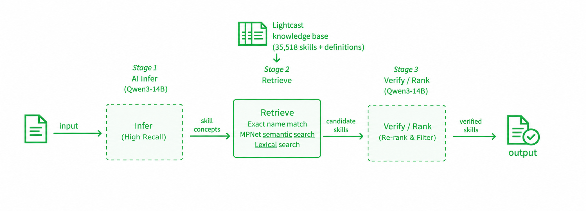

# Lightcast 岗位技能提取管线

将岗位描述（Job Description，JD）中的明确技能要求提取出来，并映射到 **Lightcast Open Skills** 标准技能分类。

管线包含以下步骤：

1. **Infer**：调用大模型从 JD 中提取技能概念及其原文证据。
2. **Evidence align**：将模型返回的证据对齐到 JD 的完整句子或条目。
3. **Hybrid retrieve**：通过精确名称、MPNet 向量语义检索和词法检索，为每个概念召回 Lightcast 候选技能。
4. **Context match**：调用大模型依据原文证据，在候选项中选择语义和粒度都等价的标准技能。
5. **Deduplicate**：按 `skill_id` 合并重复匹配，保留所有来源概念与证据。



## 项目文件

| 文件 | 用途 |
| --- | --- |
| `lightcast_infer_retrieve-mutimode-mpnet.py` | 命令行入口，执行完整管线。 |
| `lightcast_data.py` | CSV 读取与清洗、证据对齐、向量/词法检索。 |
| `lightcast_llm.py` | LLM 推理、候选匹配和去重。 |
| `model_config.py` | Together 模型预设、嵌入模型和检索默认参数。 |
| `api_config.py` | Together API 端点、超时、重试与并发配置。 |
| `infer_prompt.txt` | 从 JD 提取技能概念的系统提示词。 |
| `match_prompt.txt` | 将概念映射到 Lightcast 候选技能的系统提示词。 |
| `final_lightcast_taxonomy.csv` | Lightcast 技能分类表。 |
| `sample_2021_2025_400.csv` | 示例 JD 数据。 |

## 环境要求

- Python 3.10 或更高版本
- 可访问 Together AI 的 API Key
- 首次运行会下载 `sentence-transformers/all-mpnet-base-v2` 嵌入模型
- 可选：NVIDIA GPU / CUDA；未指定时脚本会自动在 CUDA 可用时使用 GPU，否则使用 CPU

建议在虚拟环境中安装依赖：

```powershell
python -m venv .venv
.\.venv\Scripts\Activate.ps1
python -m pip install --upgrade pip
python -m pip install numpy pandas torch faiss-cpu sentence-transformers openai httpx
```

## 配置 API Key

推荐使用环境变量，不要把真实密钥写入或提交到 `api_config.py`：

```powershell
$env:TOGETHER_API_KEY = "你的 Together API Key"
```

密钥解析优先级如下：

1. `--llm_api_key`
2. `TOGETHER_API_KEY` 或 `TOGETHERAI_API_KEY` 环境变量
3. `api_config.py` 中的 `TOGETHER_API_KEY`

## 快速开始

以下命令使用仓库内示例 JD 和分类表，先处理 5 条记录，结果写入 `outputs/smoke-test`：

```powershell
python .\lightcast_infer_retrieve-mutimode-mpnet.py `
  --jd_csv .\sample_2021_2025_400.csv `
  --taxonomy_csv .\final_lightcast_taxonomy.csv `
  --output_dir .\outputs\smoke-test `
  --model_preset deepseek-v4-flash `
  --limit 5
```

处理完整数据集：

```powershell
python .\lightcast_infer_retrieve-mutimode-mpnet.py `
  --jd_csv .\sample_2021_2025_400.csv `
  --taxonomy_csv .\final_lightcast_taxonomy.csv `
  --output_dir .\outputs\sample-run `
  --model_preset llama3.3-70b
```

> 脚本内置的 `--jd_csv` 默认路径指向原开发环境；在其他电脑上请始终显式传入 `--jd_csv`，如上例所示。

## 常用参数

| 参数 | 说明 |
| --- | --- |
| `--jd_csv` | JD CSV 路径。应包含 `DESCRIPTION_CLEAN`；若不存在则使用并清洗 `DESCRIPTION`。 |
| `--taxonomy_csv` | Lightcast 分类 CSV，必须包含 `category`、`subcategory`、`skill`、`skill_id`、`definition`。 |
| `--output_dir` | 输出目录。 |
| `--model_preset` | `model_config.py` 中的 Together 模型预设。 |
| `--llm_model` | 指定完整 Together 模型 ID，覆盖预设的模型 ID。 |
| `--llm_api_key` | 临时传入 API Key。优先使用环境变量。 |
| `--list_models` | 打印本地预设及当前账号可用的 Together 模型后退出。 |
| `--embed_model` | Sentence Transformers 嵌入模型；默认 `sentence-transformers/all-mpnet-base-v2`。 |
| `--device` | 运行嵌入模型的设备，例如 `cuda` 或 `cpu`。 |
| `--retrieve_top_k` | 每个概念的语义检索候选数，默认 5。 |
| `--lexical_top_k` | 每个概念的词法检索候选数，默认 3。 |
| `--match_batch_size` | 每批送入匹配模型的概念数，默认 4。 |
| `--infer_workers` | 并发处理 JD 数，默认由 `api_config.py` 配置。 |
| `--max_concepts` | 每条 JD 最多保留的概念数；默认不限制。 |
| `--start_row` / `--limit` | 从指定行开始并限制处理条数，适合测试或分批运行。 |
| `--no_resume` | 忽略已有检查点并重新处理所选记录。 |

可用模型预设可通过以下命令查看：

```powershell
python .\lightcast_infer_retrieve-mutimode-mpnet.py --list_models
```

也可以编辑 `model_config.py` 中的 `DEFAULT_MODEL_PRESET` 或 `MODEL_PRESETS`。

## 输出文件

每次运行会在 `--output_dir` 下生成：

| 文件 | 内容 |
| --- | --- |
| `jd_with_lightcast_skills.csv` | 宽表：保留输入 JD 字段，并增加推理概念、最终技能、匹配审计和错误信息等字段。 |
| `jd_skill_matches_long.csv` | 长表：每行一条最终选中的标准技能及其来源证据。 |
| `jd_skill_match_audit_long.csv` | 完整候选审计表：包含已选和未选候选、召回方式、相似度及匹配原因。 |
| `progress.jsonl` | 逐条写入的检查点；默认后续运行会自动跳过已成功完成的记录。 |
| `embedding_cache/` | 分类表的向量缓存；分类表或嵌入模型变化时会自动失效并重建。 |

`jd_skill_matches_long.csv` 的关键字段包括：

- `skill_id` / `skill`：最终 Lightcast 标准技能。
- `category` / `subcategory`：技能所属分类。
- `source_sentences`：JD 中支持该技能的原文。
- `infer_concepts`：模型最初抽取的概念。
- `retrieval_method`：候选的召回来源，例如 `exact_name`、`semantic`、`lexical` 或组合。
- `cosine_similarity_audit`：向量相似度，仅供审计，最终是否选择由上下文匹配决定。

## 断点续跑与重新运行

管线在每条 JD 完成后写入 `progress.jsonl`。以相同输出目录再次运行时，已成功处理的行会自动跳过：

```powershell
# 继续未完成任务
python .\lightcast_infer_retrieve-mutimode-mpnet.py --jd_csv .\sample_2021_2025_400.csv --output_dir .\outputs\sample-run

# 强制重新处理前 10 条
python .\lightcast_infer_retrieve-mutimode-mpnet.py --jd_csv .\sample_2021_2025_400.csv --output_dir .\outputs\sample-run --limit 10 --no_resume
```

## 调整提取质量

- 修改 `infer_prompt.txt` 可改变“从 JD 提取什么技能”的规则。
- 修改 `match_prompt.txt` 可改变候选技能的等价性判定标准。
- 增大 `--retrieve_top_k` / `--lexical_top_k` 可以提高候选覆盖率，但会增加上下文匹配成本。
- 降低 `--infer_workers` 可缓解 API 限流；重试、超时和默认并发也可在 `api_config.py` 中调整。
- 更换分类表或嵌入模型后，缓存会按内容指纹自动重建。

## 安全注意事项

- 不要将 API Key 提交到版本控制系统。推荐使用环境变量或密钥管理工具。
- 已泄露或曾写入源码的密钥应立即在服务商控制台撤销并生成新密钥。
- 运行会产生 Together API 调用费用；请先通过 `--limit` 做小规模验证。
